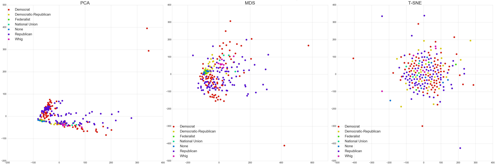
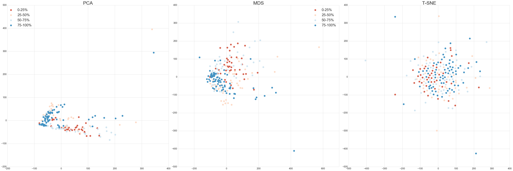
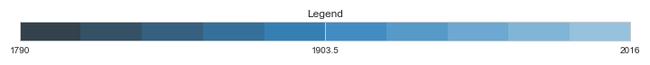
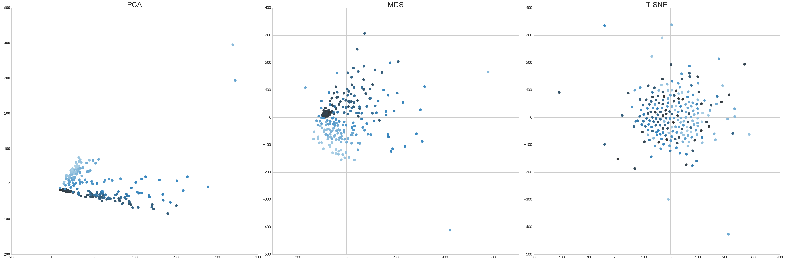
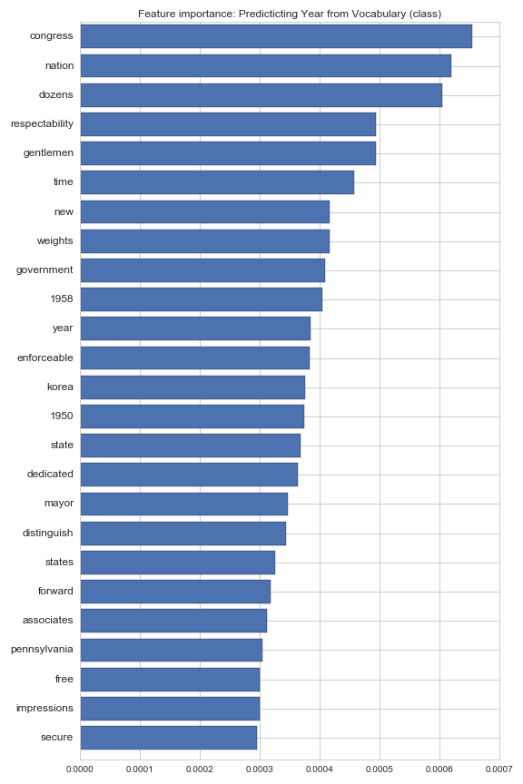

#Introduction


```{r,warning=F,echo = FALSE,  Eval = TRUE, message= FALSE, results="hide", fig.align='center'}
library(knitr)
library(rgl)
knit_hooks$set(webgl = hook_webgl)

library(bpca)
library(ggfortify)
library(ggplot2)
library(RColorBrewer)

#setwd("/Users/bobminnich/Documents/Columbia/Courses/DataVisualization/Edav-Text")
df = read.csv("3D_Plotting.csv")
df = df[,-1]
df = df[complete.cases(df),]
df1 = df[,c(1,2,3)]
df2 = df[,c(4,5,6)]
df3 = df[,c(7,8,9)]
names = df[,10]
colors_party = as.character(df[,11])
colors_year = df[,12]


```


##Document Term Matrix Visualization
Text can be an extremely difficult data type to visulize. Within a document term matrix (DTM) there can be tesns of thousands of words, associated with only a handful of documents. This creates a very sparse matrix that is hard to conceptualize. One way to combat the sparsity is to use dimension reduction techniques in order to see if relationships are avaiable. 

Three sperate forms of reduction were used on this dataset, which includes Principal Component Analysis (PCA) ,Multidimensional Scaling (MDS) and t-distributed Stochastic Neighbor Embedding(T-SNE). We want to compare these different methods to try and determine if the speeches of the presidents can help indicate different attributes.

All three of these forms used only the Document Term Matrix and did reductions from that data to two dimensions.

This data includes each president's speech, so one presdient can appear in the data multiple times.
###Political Party
First we look into the Political Party to see if we can find any distinct relationships between how a party speaks during their Presidential Speeches. This could be possible because typically the government has always been divided into two ideals, power for the states, and power for the federal government.


From this figure we can see that for PCA we can see some clustering of the Deomcrats and the Republicans. W ecan also see the Federalist,Deomocrat-Republican in a right group on the lower left portion of the PCA Cluster. For MDS we scan see some similar groups as PCA but for T-SNEW there is no visible patttern between political parties.


###Presidential Rating
We also wanted to investigate the speeches towards their ovearl presidental rating. It could be that Presidents who are doing well, have a positive outlook on the country and have a more positive message. We computed the quantiles of the presidential ratings an then grouped them by the different groups of percentiles as indicated by the legend.


We can see in PCA and MDS that there does seem to be a tight grouping on the +50% of the presidents and somewhat for hte -50%. T-SNE again does not show any significant pattern.

###Presidential Year
Presidential year was aso a potentially interesting area to look into. The presidents of the united states have had many different challenges throughout the history of America and could show significat patterns in the words that they choose for the speech.

The legend below shows the color of the points based on year:



We can see from this image we can see much better groupigs than for the Political Parties and the Ratings. This is most likely due to the trends, problems and speech changes over time and is most likely reflected in the words that the have chosen. 

To get an idae of what words might be causing this change we can look at an Importance Plot that was generated using Random Forests, in order to predict the year based on which words they have choosen in their speech. Many of these point to some notion of time, either the word itself, or how old the word useage may be. For instance, today addressing the Congressional body as "Gentleman" is very incorrect because in todays government it is made up of men and women, while in the earlier history it was made up of only men. We can see Korea, which could be allow the Random Forests to identify presidents that were leading the country during hte Korean War. 




```{r,warning=F,echo = FALSE,  Eval = TRUE, message= FALSE, results="hide", fig.align='center'}
names = df[,10]

names = as.character(names)
for(i in 1:length(names)){
  names[i] = tail(unlist(strsplit(names[i]," ")),n=1)
}

```

We also wanted to investigate this in the 3rd dimension. This was done to see if there were any more patterns that could be visualized within the time dimensionaltiy of the speeches. T-SNE was no longer included because no visible patterns were seen in the two dimensionsal plots.

The darker the color, the older the speech.


####Pan to Zoon, Click and drag to rotate

```{r webgl=TRUE, echo = FALSE,  Eval = TRUE, message= FALSE, results="hide", fig.align='center'}
padding = 0.1
zoom = 0.65
#type = "s"
size = 5


xmin1 = min(df1$MDS1) + padding
ymin1 = min(df1$MDS2) + padding
zmin1 = min(df1$MDS3) + padding
xmax1 = max(df1$MDS1) + padding
ymax1 = max(df1$MDS2) + padding
zmax1 = max(df1$MDS3) + padding

xlim1 = c(xmin1,xmax1)
ylim1 = c(ymin1,ymax1)
zlim1 = c(zmin1,zmax1)

xmin2 = min(df2$PCA1) + padding
ymin2 = min(df2$PCA2) + padding
zmin2 = min(df2$PCA3) + padding

xmax2 = max(df2$PCA1) + padding
ymax2 = max(df2$PCA2) + padding
zmax2 = max(df2$PCA3) + padding

xlim2 = c(xmin2,xmax2)
ylim2 = c(ymin2,ymax2)
zlim2 = c(zmin2,zmax2)


xmin3 = min(df3$TSN1) + padding
ymin3 = min(df3$TSN2) + padding
zmin3 = min(df3$TSN3) + padding

xmax3 = max(df3$TSN1) + padding
ymax3 = max(df3$TSN2) + padding
zmax3 = max(df3$TSN3) + padding

xlim3 = c(xmin3,xmax3)
ylim3 = c(ymin3,ymax3)
zlim3 = c(zmin3,zmax3)

open3d()
mfrow3d(1, 2, sharedMouse = TRUE, parent = NA)
#layout3d(mat, height = rep(c(3, 1), 3), sharedMouse = TRUE)

#next3d()
#next3d(current = NA, clear = TRUE, reuse = F)
#next3d(current = NA, clear = TRUE, reuse = F)
next3d(current = NA, clear = TRUE, reuse = F)
plot3d(df1,col = colors_year, size = size, xlim = xlim1, ylim = ylim1, zlim = zlim1)
title3d("MDS")


next3d(current = NA, clear = TRUE, reuse = F)
plot3d(df2,col = colors_year, size = size)

title3d("PCA")

#next3d(current = NA, clear = TRUE, reuse = T)
#plot3d(df3,col = colors_year, size = 5, xlim = xlim3, ylim = ylim3, zlim = zlim3)
#title3d("TSNE")


```
As before we can see some clustering between the different years of the speeches. MDS however has enough spread where we plotted MDS only, along with the names of hte presidents at each speech.

The darker the color, the older the speech.

####Pan to Zoon, Click and drag to rotate

```{r webgl=TRUE, echo = FALSE,  Eval = TRUE, message= FALSE, results="hide", fig.align='center'}
open3d()
zoom = 0.65
type = "p"

size = 10
text_size = 0.5
font = "FreeMono.ttf"
plot3d(df1,col = colors_year, size = size, type = type)
#triangles3d(df1,col = colors_year, size = size, type = type)

text3d(df1, texts = names,cex= text_size, col = "black",useFreeType = TRUE,adj = 1.5)
title3d("MDS")
view3d( theta = 0, phi = -60)


```

We can see that the more recent presdients, Obama,Bush and Clinton are very close to eachother for all of their speeches. They are interestingly closer to the older presidents (Jefferson, Washington, Adams etc) than many of the other presidents throughout history.

The outliers of the plot are also interesting. Truman, Taft, Carter, Polk, which exist very far from the large cluster of presdients. While researching these presidents nothing in particular set them apart from the others. Some unique facts about them though are that Truman was presdient during World War 2, Taft became Cheif Justice of the Supreme Courts, Polk based his campaign on a promise not re-run as presdient, and Carter negotiated peace talks between Egypy and Israel.


###Decode: Top 10 frequent words

The following heatmap visualization tells the frequency of top 10 words that appear in each president's speech. In each pixel box, readers will see information of president, word and its frequency. (The X-axis didn't show all words due to the plot size, but readers are able to see the detailed information when hovering over the heatmap.)
<br />
```{r,warning=F,echo = FALSE, Eval = TRUE, message= FALSE}
library(ggplot2)
library(plotly)
load("top10word_matrix.Rda")
word_union <- colnames(top10word_matrix)
president_names <- rownames(top10word_matrix)

heatm <- plot_ly(z = top10word_matrix, type = "heatmap",x = word_union,
                 y=president_names,colorbar = list(title = "word count"))%>%
  layout(margin = list(l = 150,b = 100), xaxis=list(title="words"), yaxis=list(title="presidents"), title = "Top 10 words of presidents' speech")
heatm
```